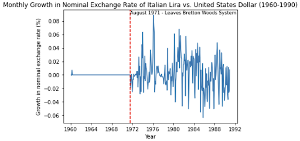
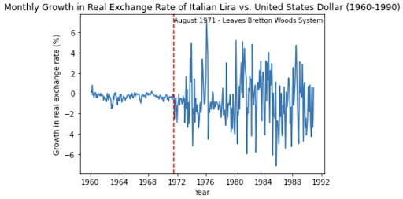
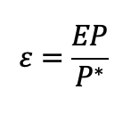
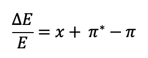
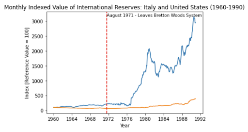
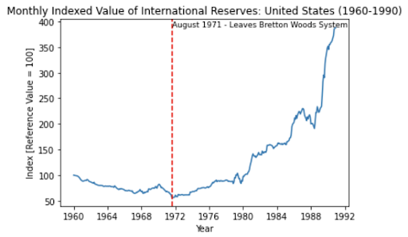
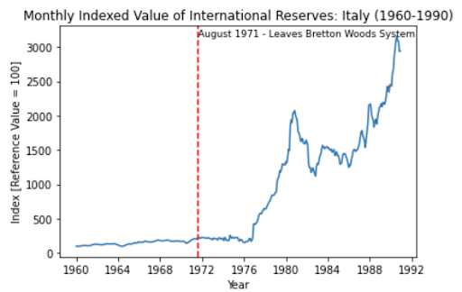
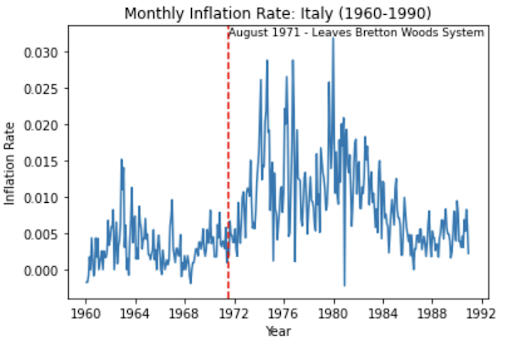
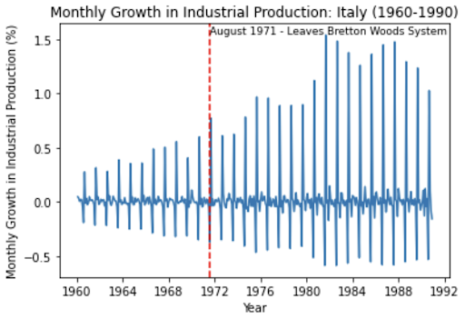
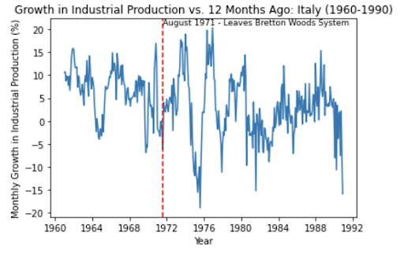

# EC1B1-Coursework

# 5.1 Comprehension and Warm Up

## What was the date that your country left the Bretton Woods system? – If two dates seem plausible, pick one and explain why you’re chosen that particular date.
The Bretton Woods system was a monetary system established in 1944 where countries agreed to adopt a fixed exchange rate between currencies using the gold standard. The US fixed its currency to gold, and other countries pegged their currencies to the US dollar. Foreign countries were able to exchange the US dollar reserves they had for gold at a fixed rate of $35 per ounce. 

However, this system was suspended in the early 1970s. In August 1971, President Richard Nixon announced they would temporarily go off the gold standard, known as the “Nixon shock.” Nonetheless, the official collapse of the Bretton Woods system was only in 1973, as between 1971 and 1973, the US and other European countries attempted to renew the Bretton Woods, which failed. We choose to use **August 1971** as the date Italy exited the system, although it officially ended in 1973, because **Italy’s exchange rate already began to float in August 1971 as they were adjusting their currency to the “Nixon shock.”**

## Describe the sense in which the departure from Bretton Woods represents a “natural experiment” about the effects of real exchange rate fluctuations on the macroeconomy.

The end of Bretton Woods can be used as a natural experiment to observe the effect of real exchange rates in the real economy (macroeconomy). This is because the break-up of the Bretton Woods system was a large discontinuous change from a near-perfect system of the fixed exchange rate to a purely floating exchange rate. This discontinuity enables the isolation of real exchange rate volatility's effect from other changes in the countries. Moreover, the Bretton Wood system was more credible and persistent than most alternative pegs (partial and dirty pegs), making the experiment of a switch cleaner. Lastly, the end of the system resulted in many large countries switching from a fully fixed exchange rate to a fully flexible exchange rate simultaneously.

# 5.2 Cleaning

## How many monthly observations are there in your dataset? Is this the number you were expecting? 

There are 373 - 1 (number of columns -1) = 372 monthly observations; this is the number that we were expecting because between January 1960 and December 1990, there are exactly 372 months.

## Why are we studying monthly data? Why not some lower-frequency such as quarterly or annual data?

Quarterly or annual data may not capture the changes or the volatility of changes happening to the economy (e.g., after leaving the Bretton Woods system). Monthly data, which we study, provides a greater level of detail and granularity. This can therefore be more useful when studying the impact of an event which results in changes, such as Italy leaving the Bretton Woods, over a short period of time. 

## What is industrial production? Why are we studying industrial production instead of another series, such as GDP?

Industrial production is the measurement of the output produced in the industrial sector of an economy, such as mining, manufacturing, electricity, and utilities. The industrial production index (IPI) measures the total volume of output produced in a given period of time. This index is a helpful tool for observing trends and changes in the industrial production of a country.

A reason for using the industrial production index instead of the GDP to evaluate the effects of floating exchange rates in Italy’s macroeconomy is that GDP is often not measured on a monthly basis, so there might be limited availability to the data needed to make precise monthly comparisons of the economy. It is usually measured quarterly or yearly. The reason is that the process of collecting accurate data to calculate the GDP can be very costly, time-consuming, and complex. Even if all the required figures are collected, the chances that the resulting GDP only partially reflects the economy and is uncertain are high. Hence, making it difficult to draw meaningful conclusions from the analysis.

However, in contrast to GDP, industrial production is often measured on a monthly basis enabling us to track the monthly changes in the Italian economy before, during, and after Bretton Woods.

## Why are you dropping outliers?

- They may skew the results since the definition of outliers is ‘the data points which are significantly different from the majority of the data. If these are not removed, they can also significantly affect the results of our analysis, and our conclusion will thus not be accurate.
- They may not represent the actual trend (or data) since outliers can be the results of some errors or other types of anomalies in the data. This may distort the analysis

## Discuss some pros and cons of the interpolation procedure we are using.

> ### Interpolation is a technique used to estimate the values for missing data points based on the values of adjacent data points. This procedure could have several pros and cons. 

### Pros:
- When we encounter any missing data points, interpolation allows us to estimate what the data would look like if the missing points were included.
- Interpolation preserves the original data structure.
- Helps smooth some small fluctuations in the data, reducing noise and thus making it easier to identify trends and patterns in the data.

### Cons:
- May introduce bias since interpolation assumes that the missing data points follow the same trend as the neighbouring points which may not always be true. 
- As interpolation smooths out variability in the data, it may make it more difficult to identify some outliers or fluctuations. Therefore, this may not suit some particular periods in our data set, for instance, immediately after the leaving of Italy from the Bretton Woods, as the volatility can be unpredictable (by interpolation) in this case since there might be some sudden changes after.

# 5.3 Data Analysis

## 5.3.1: Exchange Rate and International Reserve Graphs

##  Plot a time series graph of the monthly growth in nominal exchange rates of your country, versus the US dollar, for every month from the start to the end of the sample. Clearly indicate the time at which that country left the Bretton Woods system.

    

## Plot a time series graph of the monthly growth in real exchange rates of your country, versus the US dollar, for every month from the start to the end of the sample. Clearly indicate the time at which that country left the Bretton Woods system.

    

## Why is it useful to plot both real and nominal exchange rate growth.
Real exchange rate growth reflects changes in the relative purchasing power of currencies. It adjusts nominal exchange rates for changes in inflation. Nominal exchange rate growth, however, reflects the actual changes in the exchange rate between two currencies. As shown in the equation below, real exchange rate is the inflation adjusted version of nominal exchange rate i.e., adjusted by multiplying the price level ratio of the two countries (Italy/the United States). 
This equation shows the relationship between the real and nominal exchange rates.

    

>ε: nominal exchange rate, E: real exchange rate, P: the price of goods in Italy, P*: the price of goods in the United States 
This equation shows the relationship between the rate of growth of the real exchange rate, the nominal exchange rate and inflation.

    

>ΔE/E: the rate of growth of the real exchange rate, x: the rate of growth of the nominal exchange rate, π*: inflation in the United States, π: inflation in Italy

From this equation, it can be seen that the rates of growth of the real exchange rate and the nominal exchange rate are closely related.
Therefore, plotting both ΔE/E and x rates can be beneficial for identifying whether the exchange rate movements are being driven by changes in inflation or changes in other factors such as, in this case, Italy’s leaving the Bretton Woods system in August 1971. 

## Was the US dollar over or undervalued in the Bretton Woods system? Refer to data or figures in your answer.
Under the Bretton Woods system, the US dollar was seen as overvalued. This can be evidenced by the ‘Monthly Growth in Nominal Exchange Rate of Italian Lira VS United States Dollar (1960-1990)’ and the ‘Monthly Growth in Real Exchange Rate of Italian Lira VS United States Dollar (1960-1990)’ graphs, whereby immediately after August 1971 (Italy leaving the Bretton Woods system), there is a sharp fall in both the nominal and real exchange rates (Italian Lira to US Dollar). This explains that the value of the US Dollar in terms of Italian Lira fell. This could therefore reflect how actually, the value of the US Dollar may not be as high as when the Italian Lira was fixed. We may then conclude that the US Dollar was overvalued in the Bretton Woods system. 

## Plot a time series graph of the monthly indexed value of international reserves of Italy and the US from January 1960 until the exit of the US from Bretton Woods.

    

## Using your graph of international reserves over time, explain one reason for the US’s departure from the Bretton Woods system.
One of the main reasons the US chose to abandon the gold standard was the growing US balance of payment deficit. For the US, the 1960s was a period with more US dollar outflows than inflows. As shown in the graph above, compared to the early 1960s, the level of international reserves was relatively low in the mid-1960s. This was caused by several factors, including trade deficit, foreign investment, and increased military spending due to the Vietnam War, which all contributed to the decline in international reserves in the US. In particular, the increase in the trade deficit was a big concern to the US. The overvaluation of the US dollar and the high inflation in the US meant that imports were cheaper and exports were more expensive. As imports became more attractive and exports became less attractive, the US ended up in a trade deficit. 

    

Moreover, these large outflows of US dollars meant that the international reserves of foreign countries were increasing. For instance, the diagram below shows that during the 1960s, Italy experienced increased international reserves (US dollar). However, the gold reserves the US had to support the US dollar were limited. This uncertainty led to speculative attacks as foreign countries wanted to convert their US dollar reserves to gold. 

    

## 5.3.2: Inflation and Industrial Production Graphs 

## Plot a time series graph of monthly inflation, for every month from the start to the end of the sample. Clearly indicate the time at which that country left the Bretton Woods system.

    

## Plot a time series graph of the monthly growth in industrial production, for every month from the start to the end of the sample. Clearly indicate the time at which that country left the Bretton Woods system.

    

## Plot a time series graph of the growth in industrial production versus 12 months ago, for every month from the start to the end of the sample. Clearly indicate the time at which that country left the Bretton Woods system.

    

## Why are your results for the monthly versus 12 monthly growth in industrial production so different? Which measure is more useful?

As shown in the time series graphs above, the monthly and 12 monthly growths show very different trend patterns. This could result because the industrial production's monthly growth could be affected by some exogenous factors in the economy, which could lead to a significant increase or decrease in industrial production for a specific month. For instance, it can be noticed that in Italy, for all years, the industrial production in August was relatively lower than the other months of the year which is what causes the massive changes in the graph. In contrast, the 12 monthly growths would not have such fluctuations as it averages out all monthly productions, and so any exogenous changes in particular months would be less significant.

Hence, the result for the 12 monthly growth in industrial production would more useful as we want to see the effect of the real exchange rate volatility in the long term  since it removes any short-term fluctuations

## 5.3.3: Comparison Statistics

## Why might it be a good idea to exclude data from around the time in which the country departed from Bretton Woods? 

Immediately prior to Italy leaving the Bretton Woods system, there were many speculative attacks on the currencies of countries involved in the system. And immediately afterwards, the sudden nature of the “Nixon shock” meant that the immediate impacts of Italy leaving the Bretton Woods system may not be representative of long term trends. He aim of using this natural regression discontinuity design is to establish causality between the adoption floating exchange rates and the volatility of various macroeconomic metrics. By omitting data for the 10 months before and after Italy left the system, we aim to remove some of the confounding factors and investigate the sustained impact of countries adopting free floating exchange rates, as opposed to short term impacts which are easily influenced by exogenous variables.

## Table demonstrating the standard deviation of selected variables before and after Italy left the Bretton Woods agreement.

|Metric|Standard Deviation of Metric Before Leaving Bretton Woods Agreement|Standard Deviation of Metric After Leaving Bretton Woods Agreement|Ratio or Standard Deviation After Vs Before Leaving Bretton Woods Agreement|
|---|---|---|---|
|Italy Inflation Rate|0\.58|16\.6|28\.47|
|Difference Between the Inflation in Italy Versus the United States|0\.54|4\.11|7\.61|
|Monthly Growth of Real Exchange Rates Versus the US Dollar|0\.32|2\.36|7\.36|
|Monthly Growth of Nominal Exchange Rates Versus the US Dollar|0\.0|0\.02|36\.88|
|12 Monthly Industrial Production|0\.14|0\.36|2\.56|

## 5.3.4: What are the effects of Exchange Rates
## Taken together, what do your results imply about the effect of real exchange rate fluctuations? Is there a reason why your results are particularly compelling?

## It is perhaps more natural to consider changes in levels rather than changes in volatility. Is there evidence that the average level of nominal exchange rates changed post Bretton woods? What could be some pitfalls of using this to infer causal changes in the level of industrial production due to exchange rate differences?

